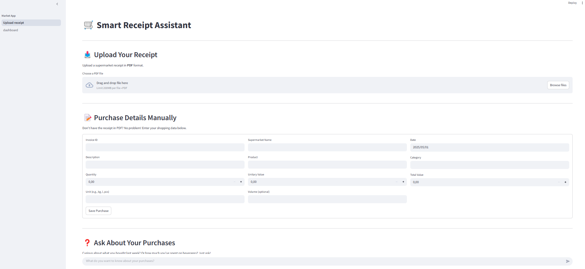
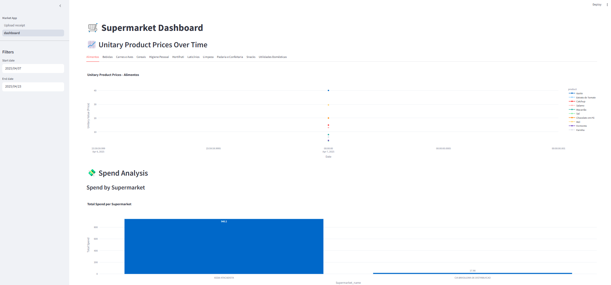
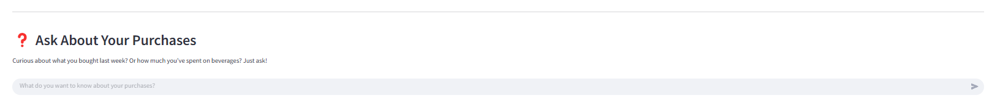

# 🛒 Smart Receipt Assistant

Welcome to the **Smart Receipt Assistant** project! This application allows you to upload supermarket receipts, extract meaningful information, and visualize your spending habits in a beautiful and interactive dashboard. Whether you're tracking your grocery purchases over time or looking for insights into how much you're spending at different supermarkets, this app has got you covered.

## Features

### 📤 **Upload Your Receipt**
Easily upload your supermarket receipts in PDF format. The app extracts the necessary information from the receipt, processes it, and saves it in the database for further analysis.

### 📝 **Add Purchases Manually**
Don't have a receipt? No problem! You can manually enter your shopping data, including details like the product name, category, supermarket, and price.

### ❓ **Ask About Your Purchases**
Want to know how much you've spent on beverages or what your last week's grocery list looked like? Just ask! Using a powerful AI agent, you can chat with the assistant to retrieve insightful answers about your purchases.

### 📈 **Supermarket Dashboard**
Get a detailed view of your spending over time. The dashboard allows you to analyze:
- **Unitary prices** of products over time.
- **Total spend** by supermarket and product category.
- **Product price comparisons** to help you make more informed purchasing decisions.

### 🧾 **Spending Reports & Smart Cart**
- **Supermarket Spending Report**: Automatically generate a personalized report with AI to uncover trends, categories, and anomalies in your purchases.
- **Smart Cart**: Simulate a shopping list and compare what you'd spend at each supermarket. Helps identify the most cost-effective way to shop.

## Technologies Used
- **Streamlit**: For creating the interactive web app.
- **Langchain & Langgraph**: For building the agent that extracts data from receipts and interacts with the database.
- **Pandas**: For data manipulation and analysis.
- **Plotly**: For visualizations and graphs.
- **SQLAlchemy & Psycopg2**: For interacting with PostgreSQL to store and query data.
- **Pydantic**: For data validation.

## Getting Started

### Prerequisites
Make sure you have the following installed:
- Python 3.11+
- Poetry for dependency management (optional but recommended)

### Installation

1. Clone the repository:
    ```bash
    git clone https://github.com/your-username/smart-receipt-assistant.git
    cd smart-receipt-assistant
    ```

2. Install dependencies using Poetry:
    ```bash
    poetry install
    ```

3. Create a `.env` file in the project root to store your PostgreSQL and OpenAI credentials. This file should look like:
    ```ini
    # OpenAI API Key
    OPENAI_API_KEY=your_openai_api_key

    # PostgreSQL Database Configuration
    HOST=your_database_host
    PORT=your_database_port
    USER=your_database_username
    PASSWORD=your_database_password
    DB_NAME=your_database_name
    ```

    > 💡 **Note**: Never commit your `.env` file to version control. Make sure it’s listed in your `.gitignore`.

4. Run the app:
    ```bash
    streamlit run market_app.py
    ```

### Database Setup
The app uses a PostgreSQL database to store invoice data. You can set up your database by running the appropriate SQL queries to create the necessary tables.

### Configuration
You can modify the app's behavior through the configuration in `market_app.py` and `src/config.py`. For example, you can change how the AI agent interacts with the data or adjust the layout of the dashboard.

## App Pages

### 📤 Upload Receipt



In this section, you can upload a receipt in PDF format, and the app will extract and save the details in the database. If you don't have a receipt, you can manually add purchase information.

### 📈 Supermarket Dashboard



The dashboard gives you an overview of your spending, including unitary prices, total spending by supermarket, and category analysis. You can also compare prices for specific products.

### 🧾 Supermarket Spending Report *(New)*

Generate a detailed AI-powered report on your supermarket spending habits. This report includes:
- Total spending per supermarket
- Product category breakdown
- Monthly spending trends
- Key insights and anomalies

### 🛒 Smart Cart *(New)*

Plan your shopping list and compare total costs at different supermarkets. Select products and quantities, and the app will:
- Calculate total cost per supermarket
- Suggest the cheapest combination of purchases across stores

### 💬 Ask the Assistant



Have a question about your purchases? Just ask! The app uses a chat interface powered by Langchain to answer your questions based on the data it has extracted.

---

Let me know if you'd like to include a live demo link, deployment instructions, or any other enhancements!
